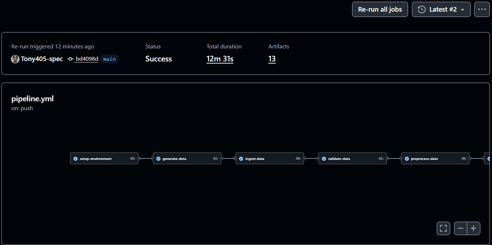

---

# **`Customer Churn Prediction: Production ML Pipeline`**

**MLOps • GitHub Actions • Scikit-learn • XGBoost • FastAPI**

A production-grade, fully automated machine learning pipeline for customer churn prediction. Implements end-to-end MLOps workflow including data validation, feature engineering, parallel model training, evaluation, API deployment, drift monitoring, and scheduled retraining—all orchestrated through GitHub Actions.


---

## **`Live-Demonstration`**

<p align="center">
  
</p>

*End-to-end pipeline visualization: data ingestion → validation → feature engineering → parallel model training → evaluation → deployment.*

---

## Strategic Objective

Customer churn represents a critical business metric requiring proactive intervention. This pipeline automates the complete machine learning lifecycle: from raw customer data ingestion to production-ready API endpoints with continuous monitoring. The system detects performance degradation via statistical drift tests and initiates automated retraining without human intervention, enabling sustained prediction accuracy over time.

---

## Dataset Specification

| Attribute | Detail |
|-----------|--------|
| **Source** | Customer relationship management (CRM) system |
| **Target Variable** | Churn (binary: 0 = Retained, 1 = Churned) |
| **Feature Count** | 10 raw attributes |

### Feature Dictionary

| Feature | Type | Description | Range |
|---------|------|-------------|-------|
| `customer_id` | Identifier | Unique customer key | Alphanumeric |
| `age` | Continuous | Customer age | 18–100 years |
| `gender` | Binary categorical | Male / Female | — |
| `tenure_months` | Discrete | Months as active customer | 0–120+ |
| `monthly_spend` | Continuous | Average monthly expenditure | Currency |
| `contract_type` | Binary categorical | Monthly / Yearly | — |
| `support_tickets` | Discrete | Total support tickets filed | 0–50+ |
| `last_login_days` | Discrete | Days since last platform login | 0–365+ |
| `satisfaction_score` | Continuous | Customer satisfaction rating | 1.0–5.0 (float) |
| `churn` | Target | Churn status (0/1) | Binary |

---

## Pipeline Architecture

### Stage Summary

| Stage | Function | Output Artifact |
|-------|----------|-----------------|
| **1. Data Ingestion** | Load Excel/CSV source data | Raw DataFrame |
| **2. Data Validation** | Quality checks, missing values, outlier detection | Validation report |
| **3. Preprocessing** | Handle missing values, encode categoricals | Cleaned DataFrame |
| **4. Feature Engineering** | Generate 10+ advanced derived features | Feature matrix |
| **5. Model Training** | Parallel training across 3 algorithms | Trained models |
| **6. Evaluation** | Comprehensive metrics comparison | Performance report |
| **7. Model Selection** | Select best performing candidate | Champion model |
| **8. Artifact Saving** | Serialize model, preprocessor, metadata | `.pkl` artifacts |
| **9. API Deployment** | FastAPI inference endpoint | Production endpoint |
| **10. Monitoring** | Drift detection, performance tracking | Drift alerts |
| **11. Automated Retraining** | Scheduled retraining on drift detection | Updated model |

---

## Model Candidates

| Model | Type | Use Case |
|-------|------|----------|
| **Logistic Regression** | Linear classifier | Baseline performance benchmark |
| **Random Forest** | Ensemble (bagging) | Non-linear relationships, feature importance |
| **XGBoost** | Gradient boosting | High accuracy, handling imbalanced data |

---

## GitHub Actions Workflow Orchestration

### Workflow 1: Main Pipeline (`pipeline.yml`)

| Attribute | Specification |
|-----------|---------------|
| **Jobs** | 17 interconnected stages |
| **Parallelism** | Concurrent model training (3 models) |
| **Artifact Passing** | Job-to-job artifact propagation |
| **Trigger** | Push to `main` branch |

### Workflow 2: Scheduled Retraining (`retrain.yml`)

| Attribute | Specification |
|-----------|---------------|
| **Schedule** | Weekly automated execution |
| **Trigger Condition** | Drift detection threshold exceeded |
| **Versioning** | Semantic versioning of model artifacts |

### Workflow 3: API Testing (`api-test.yml`)

| Attribute | Specification |
|-----------|---------------|
| **Scope** | Automated endpoint validation |
| **Test Types** | Integration, contract, performance |
| **Trigger** | Post-deployment, pull requests |

### Workflow 4: Drift Detection (`drift-detection.yml`)

| Attribute | Specification |
|-----------|---------------|
| **Frequency** | Every 12 hours |
| **Statistical Tests** | Population Stability Index (PSI), Kolmogorov-Smirnov (KS) |
| **Action** | Automatic retraining initiation on significant drift |

---

## Technology Stack

| Layer | Technology |
|-------|------------|
| **CI/CD Orchestration** | GitHub Actions (15+ automated workflows) |
| **Machine Learning** | scikit-learn, XGBoost |
| **API Framework** | FastAPI, Uvicorn |
| **Containerization** | Docker |
| **Testing** | Pytest |
| **Monitoring** | PSI, KS statistical tests |
| **Serialization** | Pickle (model artifacts) |

---

## Execution Instructions

### Prerequisites

| Requirement | Specification |
|-------------|---------------|
| **GitHub Account** | With Actions enabled |
| **Repository Access** | Write permissions to `main` branch |

### Trigger Pipeline Execution

| Action | Command |
|--------|---------|
| **Push to main** | `git push origin main` |
| **Manual trigger** | GitHub UI → Actions → Run workflow |


---

## Monitoring & Drift Detection Framework

| Test | Purpose | Threshold |
|------|---------|-----------|
| **Population Stability Index (PSI)** | Distribution shift detection between training and production | PSI > 0.1 triggers alert |
| **Kolmogorov-Smirnov (KS)** | Non-parametric comparative distribution analysis | p-value < 0.05 indicates drift |

**Automated Response:** Drift detection → Alert generation → Scheduled retraining workflow → Model version increment → Redeployment

---

## Key Performance Metrics

| Metric | Purpose | Target |
|--------|---------|--------|
| **Accuracy** | Overall correct predictions | > 85% |
| **Precision** | Churn prediction reliability | > 80% |
| **Recall** | Churn detection sensitivity | > 75% |
| **F1-Score** | Harmonic mean of precision/recall | > 0.77 |
| **AUC-ROC** | Discrimination threshold independence | > 0.90 |

---

## Repository Architecture

```
customer-churn-prediction/
├── README.md
├── .github/
│   └── workflows/
│       ├── pipeline.yml
│       ├── retrain.yml
│       ├── api-test.yml
│       └── drift-detection.yml
├── src/
│   ├── data_ingestion.py
│   ├── data_validation.py
│   ├── preprocessing.py
│   ├── feature_engineering.py
│   ├── model_training.py
│   ├── evaluation.py
│   └── deployment.py
├── models/
│   ├── champion_model.pkl
│   ├── preprocessor.pkl
│   └── metadata.json
├── api/
│   ├── main.py
│   └── requirements.txt
├── tests/
│   ├── test_api.py
│   ├── test_models.py
│   └── test_preprocessing.py
├── monitoring/
│   ├── drift_detector.py
│   └── performance_tracker.py
└── assets/
    └── mlpipeline.gif
```

---

## Limitations & Future Enhancements

| Limitation | Proposed Enhancement |
|------------|----------------------|
| Batch inference only | Real-time streaming inference with Kafka |
| Single-region deployment | Multi-region active-active API endpoints |
| Basic drift detection | Deep learning-based semantic drift detection |
| Manual feature engineering | Automated feature discovery (AutoFE) |
| Excel/CSV data sources | Direct database connectors (PostgreSQL, BigQuery) |
| No explainability layer | SHAP/LIME integration for prediction explanations |

---

